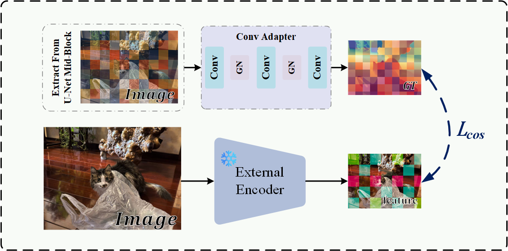

<h1 align="center"><strong>ApDepth: Aiming for Precise Monocular Depth Estimation Based on Diffusion Models</strong></h1>

<p align="center">
    <b>Stage 1: Feature Alignment and Structure Learning</b>
</p>

<div align="center">
    
</div>

<div align="center">
 <a href='https://github.com/Haruko386/ApDepth_Stage1'></a> &nbsp;&nbsp;&nbsp;&nbsp;&nbsp;
 <a href='https://www.apache.org/licenses/LICENSE-2.0'></a> &nbsp;&nbsp;&nbsp;&nbsp;&nbsp;
</div>

> This repository contains the official implementation for the **First Stage (Feature Alignment)** of **ApDepth**. In this stage, we establish a robust semantic foundation by explicitly aligning the intermediate features of the denoising U-Net with high-quality semantic representations from a pre-trained external encoder (DINOv2) using a spatial-preserving Conv Adapter and a Cosine Similarity loss.

## ⚙️ Installation

Please refer to [installation.md](./docs/installation.md) for environment setup and dependencies.

## 🗄️ Data Preparation

Modify the data directory in the training script `scripts/train_s1.sh`:

```bash
BASE_DATA_DIR=YOUR_DATA_DIR  # directory of training data
````

Prepare the [Hypersim](https://github.com/apple/ml-hypersim) and [Virtual KITTI 2](https://europe.naverlabs.com/research/computer-vision/proxy-virtual-worlds-vkitti-2/) datasets and save them into `${BASE_DATA_DIR}` following the data structure protocol of [Marigold](https://github.com/prs-eth/Marigold?tab=readme-ov-file).

## 📥 Checkpoint Preparation

Modify the checkpoint directory in `scripts/train_s1.sh`:

```bash
BASE_CKPT_DIR=YOUR_CHECKPOINT_DIR  # directory of pretrained checkpoint
```

1.  **Diffusion Backbone:** Download the Stable Diffusion v2 [checkpoint](https://huggingface.co/stabilityai/stable-diffusion-2) into `${BASE_CKPT_DIR}`.
2.  **External Semantic Encoder:** Download the checkpoint of [DINOv2](https://github.com/facebookresearch/dinov2) into the `checkpoints/` directory (This provides the patch-level semantic priors for feature alignment).

## 🏋️ Training (Stage 1)

Once the datasets and checkpoints are properly set up, you can start the first-stage training (Feature Alignment) by running the following script:

```bash
bash scripts/train_s1.sh
```

*Note: The first stage is trained for 20,000 iterations purely in the feature space to prevent the network from prematurely overfitting to low-level texture details.*

## 🤝 Acknowledgements

Our code is built upon the foundational work of [Marigold](https://github.com/prs-eth/Marigold) and [DepthMaster](https://www.google.com/search?q=https://github.com/indu1ge/DepthMaster). We also profoundly thank the developers of [DINOv2](https://github.com/facebookresearch/dinov2) for providing the exceptional pre-trained vision foundation models.

## 🎫 License

This work is licensed under the Apache License, Version 2.0 (as defined in the [LICENSE](https://www.google.com/search?q=LICENSE.txt)).